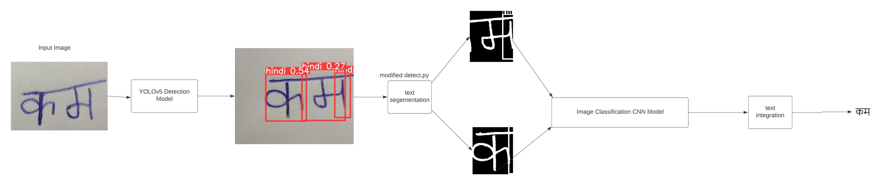

# OCR_for_hindi_english
<h1>Problem Statement</h1>
<h5>
  One of the most promising applications of character recognition in computer vision is optical character
recognition and documents monitoring which is becoming increasingly important in our daily lives and as well as in
our professional lives. Since Now also there are some forms and documents which are filled handwritten, and a
person must fill the details manually for storing on online database which is very time-consuming process. And
specially in India some people fill handwritten forms and document in their native languages which is very difficult
job for officers to recognize and understand.
</h5>
<h5>
  There are some present technologies for OCR but all are generally for English handwritten text. But as in India ,
Hindi being our national language which have very complex text formations and different letters it is almost
impossible to use simple OCR. Since EasyOCR python library have an ability to recognise Hindi text from image
but with constraint that text in image should digitally printed, which is in-efficient for Hindi because people
generally prefer handwritten Hindi format in forms and documents.
</h5>
 
# Solution
<h1>Solution-1</h1>

>Deep learning has recently been demonstrated to be a highly
strong image identification technology. The biggest distinguishing
feature is that improved image features for identification are
derived automatically via training. One of the approaches that
meets the requirements of the deep learning approach is the
convolutional neural network (CNN).Hence the general data would be
handwritten text on image or document or may some images might
not have good quality of pixels, so we need more type feature and
very deep convolution network for recognition.

>Convolutional neural networks, unlike
traditional artificial neural networks, can
estimate the score function directly from
picture pixels. Data augmentation techniques
based on geometric transformation were
applied to increase the size of training
images. We also use the Max-Pooling function
for the data, and the features extracted
from this function are used to train the
network. It is demonstrated that using data
augmentation and by increasing the number
of convolution layers, these networks
exhibited much better performance, making
these networks suitable for practical
applications.

>We have deployed 3 model approach instead of traditional single
model approach, where the character list is equally divided among
each model and the word or sentence is fed to each one of the
model , then whichever model provides maximum accuracy out of
three is selected.

<h1>Data Input-Output</h1>
 

<h1>Conclusion</h1>
In conclusion, we applied the knowledge of Convolution Neural Networks to identify the input image
or document we have achieved a satisfactory accuracy for handwritten text recognition for both
Hindi and English.

Secondly, we will deployed our trained model as online web app using Flask . Where the user uploads
the photo or can take snapshot and gets a digital converted text result based on the prediction
without change in any format of document. We will print same resulted text on document from pixel
coordinate from where it was detected with help of OpenCV and create another copy.

Thus our final objective would be to create a Real time web app ,where users can use online camera
to scan documents, get their text recognised and digitalise it.
